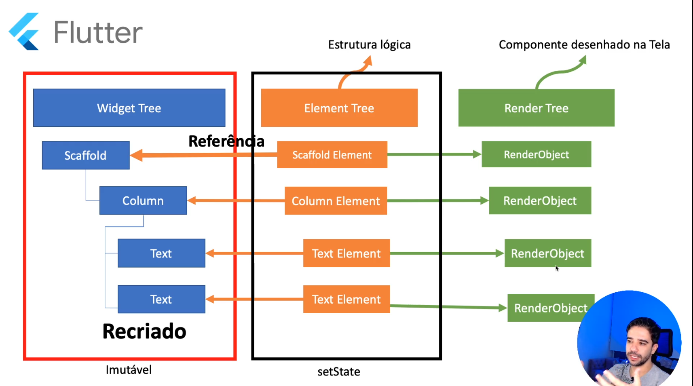
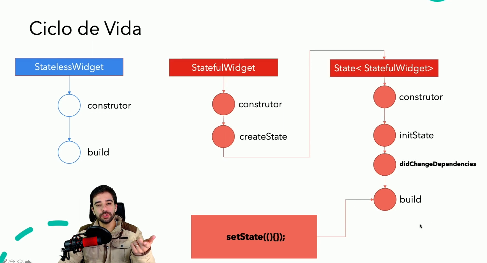

# Flutter

## Criando projetos flutter via linha de comando

Para criar projetos Flutter via linha de comando, primeiro você precisa instalar o Flutter SDK no seu computador. Após a instalação, você pode utilizar o comando `flutter create` para criar um novo projeto.

Siga estes passos:

1.  Abra um terminal (no macOS e Linux) ou prompt de comando (no Windows).
2.  Navegue até o diretório onde deseja criar o projeto.
3.  Utilize o seguinte comando para criar um projeto Flutter personalizado:

```powershell
flutter create \
--project-name=flutter_primeiros_passos \
--org br.com.victorfariasdeoliveira \
--platforms android \
-a kotlin \
./flutter_primeiros_passos
```

Vamos analisar os parâmetros utilizados:

- `--project-name=flutter_primeiros_passos`: Define o nome do projeto como "flutter_primeiros_passos".
- `--org br.com.victorfariasdeoliveira`: Define a organização do projeto como "br.com.victorfariasdeoliveira". Essa informação é usada para gerar o pacote do aplicativo no formato "org_name.project_name" (por exemplo,"br.com.victorfariasdeoliveira.flutter_primeiros_passos").
- `--platforms android`: Define que o projeto deve ser criado apenas com suporte para a plataforma Android.
- `-a kotlin`: Especifica que o código nativo gerado para a plataforma Android deve ser escrito em Kotlin. Por padrão, o Flutter gera código nativo em Java para projetos Android.
- `./flutter_primeiros_passos`: Define o diretório em que o projeto será criado. Neste caso, o projeto será criado no diretório atual em uma pasta chamada "flutter_primeiros_passos".

4. Navegue até o diretório do projeto recém-criado:

```powershell
cd flutter_primeiros_passos
```

5. (Opcional) Verifique se tudo está funcionando corretamente executando o aplicativo de exemplo no emulador ou dispositivo conectado. Certifique-se de que o emulador esteja em execução ou o dispositivo esteja conectado, e use o comando:

```powershell
flutter run
```

Agora você tem um novo projeto Flutter criado via linha de comando com opções específicas, e está pronto para começar a desenvolver seu aplicativo. Você pode abrir a pasta do projeto no seu editor de código favorito e começar a editar os arquivos, como "lib/main.dart", para personalizar seu aplicativo.

---

## O que é Flutter

O Flutter é um framework de desenvolvimento de código aberto criado pelo Google para criar aplicativos móveis, web e desktop a partir de uma única base de código. Ele é construído usando a linguagem de programação Dart e oferece uma ampla gama de widgets e ferramentas para ajudar a criar interfaces de usuário ricas e responsivas com facilidade.

Resumidamente, o Flutter permite que desenvolvedores:

1. Criem aplicativos para diferentes plataformas (Android, iOS, web e desktop) usando uma única base de código, o que melhora a produtividade e reduz a complexidade de manutenção.
2. Desfrutem de uma experiência de desenvolvimento rápida e iterativa com a funcionalidade de recarga rápida, permitindo que os desenvolvedores vejam as alterações no código quase em tempo real, sem a necessidade de reiniciar o aplicativo.
3. Construam interfaces de usuário personalizadas e atraentes usando uma grande variedade de widgets pré-construídos e personalizáveis.

Em suma, o Flutter é um framework de desenvolvimento multiplataforma que permite aos desenvolvedores criar aplicativos de alta qualidade com uma única base de código e uma experiência de desenvolvimento eficiente.

## O que torna o Flutter único?

O Flutter possui várias características que o tornam único e atraente para os desenvolvedores. Algumas das principais características incluem:

1. Multiplataforma com uma única base de código: Flutter permite desenvolver aplicativos para Android, iOS, web e desktop (macOS, Windows e Linux) usando uma única base de código. Isso aumenta a produtividade dos desenvolvedores e reduz a complexidade da manutenção do aplicativo.

2. Rápido desenvolvimento iterativo: A funcionalidade de "Hot Reload" do Flutter permite que os desenvolvedores vejam as alterações no código quase em tempo real, sem a necessidade de reiniciar o aplicativo. Isso acelera significativamente o processo de desenvolvimento e permite um fluxo de trabalho mais ágil.

3. Mecanismo de renderização próprio: Flutter utiliza o Skia, um mecanismo de renderização 2D de alto desempenho, para desenhar interfaces de usuário diretamente no canvas, independentemente da plataforma. Isso garante uma aparência e desempenho consistentes em todas as plataformas, além de permitir a criação de UIs altamente personalizadas.

4. Widgets ricos e personalizáveis: Flutter vem com uma grande variedade de widgets pré-construídos e personalizáveis, facilitando a criação de interfaces de usuário atraentes e funcionais. A estrutura baseada em widgets do Flutter permite um alto nível de composição e reutilização, promovendo a modularidade e a manutenibilidade do código.

5. Linguagem de programação Dart: Flutter utiliza a linguagem Dart, também desenvolvida pelo Google. Dart é uma linguagem de programação moderna, fácil de aprender e otimizada para a criação de aplicativos móveis e web. Possui recursos avançados, como tipagem estática e Just-In-Time (JIT) e compilação Ahead-Of-Time (AOT), proporcionando alto desempenho e uma experiência de desenvolvimento agradável.

6. Ecossistema e comunidade crescentes: Flutter tem uma comunidade de desenvolvedores em rápido crescimento, resultando em um ecossistema rico de bibliotecas e pacotes de terceiros. O suporte da comunidade e o engajamento com o projeto tornam mais fácil encontrar recursos, ajuda e informações para desenvolver aplicativos de qualidade com o Flutter.

Essas características únicas, combinadas com o suporte contínuo do Google, tornam o Flutter uma opção atraente para muitos desenvolvedores que buscam criar aplicativos multiplataforma de alta qualidade.

## Com qual tecnologia o Flutter é construído?

O Flutter é construído usando várias tecnologias e componentes principais:

1. Linguagem de programação Dart: O Flutter é desenvolvido usando a linguagem Dart, criada pelo Google. Dart é uma linguagem orientada a objetos, com tipagem estática e suporte a inferência de tipos. A linguagem foi projetada para ser fácil de aprender e otimizada para o desenvolvimento de aplicativos móveis e web. O Dart permite compilação Just-In-Time (JIT) para desenvolvimento rápido e recarga a quente, bem como compilação Ahead-Of-Time (AOT) para melhor desempenho em tempo de execução.

2. Mecanismo Skia: O Flutter utiliza o mecanismo de renderização Skia, um mecanismo gráfico 2D de alto desempenho e código aberto, para desenhar interfaces de usuário diretamente no canvas, independentemente da plataforma. Skia é usado pelo Google Chrome, Chrome OS e muitos outros projetos e fornece suporte para uma ampla gama de funções de desenho e manipulação de imagens.

3. Framework Flutter: O framework Flutter, construído sobre a linguagem Dart e o mecanismo Skia, oferece uma ampla variedade de widgets e ferramentas para criar interfaces de usuário ricas e responsivas. A estrutura baseada em widgets permite que os desenvolvedores componham interfaces complexas a partir de componentes menores e reutilizáveis. Além disso, o Flutter oferece um conjunto completo de widgets que seguem as diretrizes de design do Material Design (Android) e Cupertino (iOS).

4. Dart Native: O Flutter usa a plataforma Dart Native para compilar e executar código Dart em plataformas nativas. Isso inclui o Dart VM, que oferece compilação JIT e suporte a recarga a quente para desenvolvimento rápido, e o Dart AOT Compiler, que compila o código Dart em código de máquina nativo para melhor desempenho em tempo de execução.

5. Dart Web: Para a compilação de aplicativos web, o Flutter usa o Dart Web, que compila o código Dart em JavaScript otimizado, permitindo que os aplicativos Flutter sejam executados em navegadores modernos.

Essas tecnologias trabalham juntas para fornecer um ambiente de desenvolvimento de aplicativos completo e eficiente que permite aos desenvolvedores criar aplicativos móveis, web e desktop de alta qualidade com uma única base de código.

## Como o Flutter executa meu código no Android? E no iOS?

O Flutter permite criar aplicativos nativos para Android e iOS a partir de uma única base de código em Dart. A maneira como o Flutter executa o código do aplicativo nas duas plataformas é ligeiramente diferente, mas o resultado final é um aplicativo nativo com alto desempenho em ambas as plataformas.

**Execução no Android:**

1. O código Dart do aplicativo é compilado em código de máquina nativo ARM ou x86 usando a compilação Ahead-Of-Time (AOT).
2. O Flutter utiliza uma fina camada de código C++ chamada "engine Flutter" que é responsável por executar o código Dart e se comunicar com as APIs e serviços do sistema operacional Android através da Android Native Development Kit (NDK).
3. A engine Flutter é incorporada ao aplicativo Android como uma biblioteca nativa e empacotada no arquivo APK (Android Application Package) junto com os assets do aplicativo (como imagens, fontes e arquivos de configuração).
4. Quando o aplicativo é iniciado, a engine Flutter é carregada e inicia a execução do código Dart. A interface do usuário é renderizada usando o mecanismo de renderização Skia, e a engine Flutter gerencia a comunicação com as APIs e serviços nativos do Android.

**Execução no iOS:**

1. O código Dart do aplicativo é compilado em código de máquina nativo ARM usando a compilação Ahead-Of-Time (AOT).
2. O Flutter utiliza a mesma camada de código C++ (engine Flutter) que é usada no Android para executar o código Dart e se comunicar com as APIs e serviços do sistema operacional iOS através de uma ponte para o Objective-C.
3. A engine Flutter é incorporada ao aplicativo iOS como uma biblioteca nativa e empacotada no arquivo IPA (iOS App Store Package) junto com os assets do aplicativo (como imagens, fontes e arquivos de configuração).
4. Quando o aplicativo é iniciado, a engine Flutter é carregada e inicia a execução do código Dart. A interface do usuário é renderizada usando o mecanismo de renderização Skia, e a engine Flutter gerencia a comunicação com as APIs e serviços nativos do iOS.

Embora o processo de execução do código seja um pouco diferente entre as plataformas, o Flutter garante que a interface do usuário e o desempenho do aplicativo sejam consistentes em ambos os sistemas operacionais. Além disso, o Flutter fornece um conjunto completo de widgets que seguem as diretrizes de design do Material Design (Android) e Cupertino (iOS) para que os aplicativos tenham uma aparência nativa em ambas as plataformas.

---

## O que são Widgets?

No contexto do Flutter, widgets são os elementos básicos da interface do usuário que você utiliza para construir a apresentação visual e interações do seu aplicativo. Um widget pode ser uma simples representação visual, como um texto ou imagem, ou pode ser um elemento interativo, como um botão ou um campo de entrada de texto. Widgets também podem ser organizados em estruturas hierárquicas para criar interfaces de usuário mais complexas.

O Flutter adota uma abordagem baseada em widgets para a construção de interfaces do usuário. Isso significa que tudo no Flutter, desde o layout até os componentes visuais e a própria aplicação, é composto por widgets. Essa abordagem tem várias vantagens, incluindo:

1. **Composição**: Os widgets podem ser facilmente combinados para criar interfaces mais complexas e ricas em recursos. Isso promove a reutilização de código e permite que os desenvolvedores criem componentes personalizados com facilidade.

2. **Personalização**: O Flutter oferece uma ampla variedade de widgets pré-construídos que seguem as diretrizes de design do Material Design (Android) e Cupertino (iOS). No entanto, os desenvolvedores também podem criar seus próprios widgets personalizados para obter a aparência e o comportamento desejados.

3. **Reatividade**: A arquitetura baseada em widgets facilita a criação de aplicativos reativos. Os widgets são imutáveis por padrão e são reconstruídos quando ocorrem mudanças de estado no aplicativo. Isso simplifica a atualização da interface do usuário em resposta a eventos ou alterações nos dados.

Existem dois tipos principais de widgets no Flutter: StatelessWidget e StatefulWidget. Um StatelessWidget é um widget que descreve uma parte da interface do usuário que não depende de nenhum estado, enquanto um StatefulWidget é um widget que pode mudar ao longo do tempo (ou seja, é mutável) e pode armazenar informações de estado que podem ser alteradas ao longo do tempo.

Em resumo, os widgets são os componentes fundamentais da interface do usuário no Flutter, e o desenvolvimento no Flutter envolve a composição e personalização de widgets para criar aplicativos visualmente atraentes e interativos.

## Paralelos entre Widgets em Flutter e Componentes em React

Sim, existem paralelos entre os widgets do Flutter e os componentes do React Native. Ambos são elementos fundamentais para construir a interface do usuário nos respectivos frameworks e têm um papel semelhante no processo de desenvolvimento. Vamos comparar os dois:

**Widgets no Flutter:**

1. São elementos básicos de interface do usuário no Flutter, usados para construir a UI do aplicativo.
2. São organizados em uma hierarquia baseada em árvore.
3. São imutáveis por padrão. Quando o estado muda, os widgets são reconstruídos.
4. Existem StatelessWidget e StatefulWidget no Flutter, representando widgets sem estado e com estado, respectivamente.
5. São escritos em Dart, a linguagem de programação usada pelo Flutter.

**Componentes no React Native:**

1. São elementos básicos de interface do usuário no React Native, usados para construir a UI do aplicativo.
2. São organizados em uma hierarquia baseada em árvore.
3. São baseados no conceito de componentes do React (biblioteca JavaScript). No React Native, os componentes reagem a mudanças de estado usando o mecanismo de renderização e atualização do React.
4. Existem componentes funcionais e componentes de classe no React (e, consequentemente, no React Native). Componentes funcionais são semelhantes aos StatelessWidget do Flutter, enquanto componentes de classe podem ser comparados aos StatefulWidget.
5. São escritos em JavaScript, a linguagem de programação usada pelo React Native (e, às vezes, com a adição de TypeScript para tipagem estática).

Enquanto os widgets do Flutter e os componentes do React Native têm um propósito e função semelhantes, eles são baseados em tecnologias diferentes (Dart para Flutter e JavaScript para React Native) e têm algumas diferenças na implementação e abordagem. No entanto, os desenvolvedores familiarizados com um dos frameworks podem achar mais fácil aprender o outro devido às semelhanças na organização e no funcionamento da interface do usuário.

## Stateful Widgets vs Stateless Widgets

No Flutter, os widgets são a base para a construção de interfaces de usuário. Há dois tipos principais de widgets: `StatelessWidget` e `StatefulWidget`. Ambos têm propósitos diferentes e são usados de acordo com as necessidades do aplicativo.

### Stateless

- Um widget que descreve parte da interface do usuário que não depende de nenhum estado.
- Não armazena informações mutáveis.
- É imutável, o que significa que, uma vez criado, não pode ser alterado. Se você precisa alterar a aparência do widget, deve criar um novo widget com as novas propriedades.
- Ideal para partes da interface do usuário que permanecem relativamente constantes e não precisam ser atualizadas com base em interações do usuário ou eventos de aplicativo.

Exemplo de StatelessWidget:

```dart
class MeuStatelessWidget extends StatelessWidget {
  final String texto;

  MeuStatelessWidget({required this.texto});

  @override
  Widget build(BuildContext context) {
    return Text(texto);
  }
}
```

### Statefull

- Um widget que pode mudar ao longo do tempo (ou seja, é mutável).
- Pode armazenar informações de estado que podem ser alteradas ao longo do tempo.
- É composto por duas classes: a classe StatefulWidget e uma classe separada que estende `State`.
- Ideal para partes da interface do usuário que precisam ser atualizadas dinamicamente com base em interações do usuário, eventos de aplicativo ou dados que mudam com o tempo.

Exemplo de StatefulWidget:

```dart
class MeuStatefulWidget extends StatefulWidget {
  @override
  _MeuStatefulWidgetState createState() => _MeuStatefulWidgetState();
}

class _MeuStatefulWidgetState extends State<MeuStatefulWidget> {
  int contador = 0;

  void incrementarContador() {
    setState(() {
      contador = contador + 1;
    });
  }

  @override
  Widget build(BuildContext context) {
    return Column(
      children: [
        Text('Contador: $contador'),
        ElevatedButton(
          onPressed: incrementarContador,
          child: Text('Incrementar'),
        ),
      ],
    );
  }
}

```

Em resumo, um StatelessWidget é usado para partes estáticas da interface do usuário que não precisam de atualizações dinâmicas, enquanto um StatefulWidget é usado para partes mutáveis da interface do usuário que requerem atualizações e interações.

## Árvore de componentes

No Flutter, a estrutura de uma aplicação é organizada em três partes principais: Widget Tree, Element Tree e Render Tree. Essas árvores trabalham juntas para criar e atualizar a interface do usuário.

1.  Widget Tree (Árvore de Widgets): A Widget Tree é a representação hierárquica dos componentes da interface do usuário no Flutter. Widgets são elementos imutáveis que descrevem como a interface deve aparecer. Eles são os blocos de construção básicos do Flutter e podem ser simples, como um texto ou um botão, ou complexos, como um container que contém outros widgets.

Quando você escreve o código do aplicativo, você essencialmente define a Widget Tree, que então é usada para construir a Element Tree.

2.  Element Tree (Árvore de Elementos): A Element Tree é uma representação em tempo de execução da Widget Tree. Cada widget na Widget Tree tem um elemento correspondente na Element Tree. Os elementos são instâncias mutáveis que gerenciam o ciclo de vida dos widgets e facilitam a atualização da interface do usuário.

A principal função dos elementos é conectar a Widget Tree à Render Tree. Quando um widget é atualizado, um novo elemento é criado para substituir o elemento antigo na Element Tree, que por sua vez atualiza a Render Tree.

3.  Render Tree (Árvore de Renderização): A Render Tree é uma representação otimizada da interface do usuário, responsável pelo layout e pintura dos widgets na tela. A Render Tree é criada a partir da Element Tree, mas contém apenas os elementos que realmente precisam ser renderizados, como texto, imagens e formas.

A Render Tree gerencia o processo de layout (posicionamento e dimensionamento dos elementos) e pintura (desenho dos elementos na tela). Quando ocorre uma mudança na Element Tree, a Render Tree é atualizada para refletir essas mudanças, e o aplicativo é redesenhado na tela.

Em resumo, a Widget Tree descreve a estrutura da interface do usuário, a Element Tree gerencia o ciclo de vida e atualizações dos widgets, e a Render Tree lida com o layout e a renderização na tela. Essas três árvores trabalham em conjunto para criar e atualizar a interface do usuário do aplicativo Flutter.



> Na imagem, podemos ver a ligação entre as árvores.

## Ciclo de Vida

O ciclo de vida de um widget no Flutter é um aspecto importante a ser compreendido ao trabalhar com essa estrutura. Os widgets podem ser divididos em dois tipos: `StatelessWidget` e `StatefulWidget`. Vamos ver o ciclo de vida de cada um.

### StatelessWidget:

Um `StatelessWidget` é um widget que descreve parte da interface do usuário que não depende de nenhuma informação de estado. Ele tem um ciclo de vida simples:

1. Constructor (Construtor): O construtor é chamado quando o widget é criado.
2. Build: O método `build` é chamado para descrever a aparência do widget na tela. Ele recebe um objeto `BuildContext` como parâmetro e retorna um novo widget que descreve a aparência do widget na tela. O método `build` é chamado toda vez que o Flutter precisa redesenhar a interface do usuário.

### StatefulWidget:

Um `StatefulWidget`, por outro lado, é um widget que pode mudar ao longo do tempo. Ele tem um ciclo de vida mais complexo, que envolve a criação de um objeto de estado:

1. Constructor (Construtor): O construtor do StatefulWidget é chamado quando o widget é criado.
2. createState: O método `createState` é chamado imediatamente após o construtor para criar um objeto `State` que armazenará o estado do widget.
3. State Constructor (Construtor do Estado): O construtor do objeto `State` é chamado após a criação do objeto `State`.
4. initState: O método `initState` é chamado imediatamente após o construtor do objeto `State`. Ele é usado para inicializar variáveis de estado ou realizar qualquer configuração inicial. Esse método é chamado apenas uma vez durante o ciclo de vida do objeto `State`.
5. didChangeDependencies: Este método é chamado quando um objeto `InheritedWidget`, do qual este widget depende, muda. Ele pode ser chamado imediatamente após `initState` e sempre que as dependências mudam durante o ciclo de vida do objeto `State`.
6. Build: Assim como no StatelessWidget, o método `build` é chamado para descrever a aparência do widget na tela. Ele é chamado sempre que o estado muda e o Flutter precisa redesenhar a interface do usuário.

Além desses métodos, o objeto `State` também possui métodos como `didUpdateWidget` (chamado quando o StatefulWidget é atualizado) e `dispose` (chamado quando o objeto `State` está prestes a ser removido da árvore).

Em resumo, os StatelessWidgets têm um ciclo de vida simples, com construtor e método `build`, enquanto os StatefulWidgets têm um ciclo de vida mais complexo, envolvendo a criação de um objeto `State` e a utilização de diversos métodos de ciclo de vida, como `initState`, `didChangeDependencies`, `build`, `didUpdateWidget` e `dispose`.



> Na imagem, podemos ver o ciclo de vida em detalhes.

## Executando funções depois da tela pronta (addPostFrameCallback)

O `addPostFrameCallback` é uma função no Flutter que permite programar a execução de um trecho de código logo após a tela ter sido completamente desenhada e renderizada. Ele é útil quando você deseja realizar alguma ação que dependa de a interface do usuário estar pronta, como exibir um aviso, uma mensagem ou qualquer animação.

Em termos simples, imagine que o Flutter desenha sua interface como uma série de imagens chamadas "frames". Depois que um frame é desenhado e a interface do usuário é atualizada, você pode usar o `addPostFrameCallback` para executar um código específico. Isso garante que sua ação seja realizada somente depois que a tela estiver pronta e visível para o usuário. Um exemplo comum de uso é exibir um `SnackBar` ou um `AlertDialog` assim que a tela é carregada.

Para usar o `addPostFrameCallback` em sua aplicação Flutter, siga estas etapas:

1. Importe o pacote `flutter/widgets.dart`:

```dart
import 'package:flutter/widgets.dart';
```

2. Registre o callback usando `WidgetsBinding.instance.addPostFrameCallback` dentro do método `initState` de um `StatefulWidget`:

```dart
class _MyWidgetState extends State<MyWidget> {
  @override
  void initState() {
    super.initState();
    WidgetsBinding.instance?.addPostFrameCallback((_) {
      // Coloque aqui o código que você deseja executar após a conclusão do próximo frame de renderização.
    });
  }

  // ...
}
```

Aqui está um exemplo completo de como usar o `addPostFrameCallback` para exibir um `SnackBar` após a conclusão do próximo frame:

```dart
import 'package:flutter/material.dart';
import 'package:flutter/widgets.dart';

void main() {
  runApp(MyApp());
}

class MyApp extends StatelessWidget {
  @override
  Widget build(BuildContext context) {
    return MaterialApp(
      home: Scaffold(
        appBar: AppBar(title: Text('Exemplo')),
        body: MyWidget(),
      ),
    );
  }
}

class MyWidget extends StatefulWidget {
  @override
  _MyWidgetState createState() => _MyWidgetState();
}

class _MyWidgetState extends State<MyWidget> {
  @override
  void initState() {
    super.initState();
    WidgetsBinding.instance.addPostFrameCallback((_) {
      ScaffoldMessenger.of(context).showSnackBar(
        SnackBar(content: Text('Olá, Snackbar!')),
      );
    });
  }

  @override
  Widget build(BuildContext context) {
    return Center(child: Text('Exemplo de addPostFrameCallback'));
  }
}
```

No exemplo acima, o `SnackBar` é exibido assim que a tela é carregada e renderizada. O `addPostFrameCallback` garante que a ação seja executada somente após a interface do usuário estar pronta.

---

# Flutter Mão na Massa

> Descrição das aulas

- Inicializamos um novo projeto, o flutter mão na massa
- Limpamos os comentários dentro do main.dart com o comando no visual studio code:

```text
"ctrl + shif + p" -> Remove All Comments
```

> > Só é possível graças a extensão _Remove Comments_

- Configuração do arquivo Main.dart

```dart
import 'package:flutter/material.dart';
import 'package:flutter_maonamassa/home/home_page.dart';


void main() {
  runApp(const MyApp());
}

class MyApp extends StatelessWidget {
  const MyApp({super.key});

  @override
  Widget build(BuildContext context) {
    return const MaterialApp(
      title: 'Flutter Demo',
      home: HomePage(),
      debugShowCheckedModeBanner: false,
    );
  }
}
```

> > Este arquivo é separado apenas para configurações, e apontar para a tela principal do app. Nessa tela principal criaremos a lógica e o layout para que os fluxos do app aconteçam.

## Principais Widgets

No Flutter, os widgets são os principais componentes para criar a interface do usuário de um aplicativo. Existem muitos widgets disponíveis, mas aqui estão alguns dos principais e mais comumente usados:

1.  StatelessWidget e StatefulWidget: São as classes básicas para criar widgets imutáveis e mutáveis, respectivamente.
2.  MaterialApp: É o widget principal para aplicativos baseados em Material Design. Ele proporciona a estrutura básica de um aplicativo.
3.  Scaffold: Fornece uma estrutura básica para a tela do aplicativo, como a AppBar, o Drawer e o FloatingActionButton.
4.  AppBar: Representa a barra de aplicativos no topo da tela. Pode incluir um título, botões de ação e outros elementos.
5.  Text: É o widget responsável por exibir um simples texto formatado na tela.
6.  TextField: Permite a entrada de texto pelo usuário e é usado para criar campos de texto, como caixas de pesquisa e formulários.
7.  RaisedButton, FlatButton e IconButton: São widgets usados para criar diferentes tipos de botões com funcionalidades específicas.
8.  Column e Row: São widgets usados para organizar outros widgets verticalmente (Column) ou horizontalmente (Row).
9.  Container: Um widget que permite adicionar preenchimento, margens, bordas e outros atributos de estilo aos widgets filhos.
10. Image: É o widget responsável por exibir imagens a partir de diferentes fontes, como assets ou URLs.
11. ListView: Permite criar listas roláveis de widgets.
12. Stack: Permite sobrepor widgets uns sobre os outros.
13. Card: Um widget que exibe informações em um bloco de material elevado, geralmente usado para representar itens em uma lista.
14. GridView: Permite criar uma grade rolável de widgets.
15. Estes são apenas alguns dos muitos widgets disponíveis no Flutter. A lista completa pode ser encontrada na documentação oficial do Flutter: [https://api.flutter.dev/flutter/widgets/widgets-library.html](https://api.flutter.dev/flutter/widgets/widgets-library.html)
